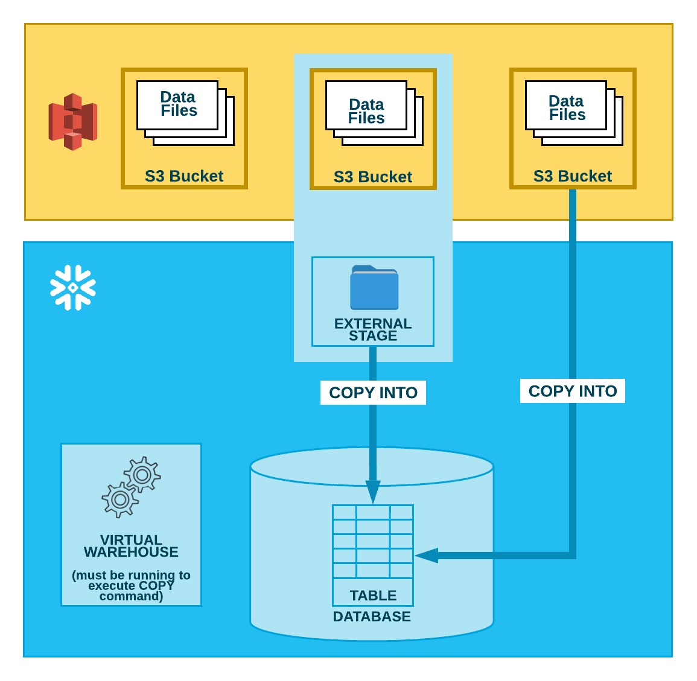
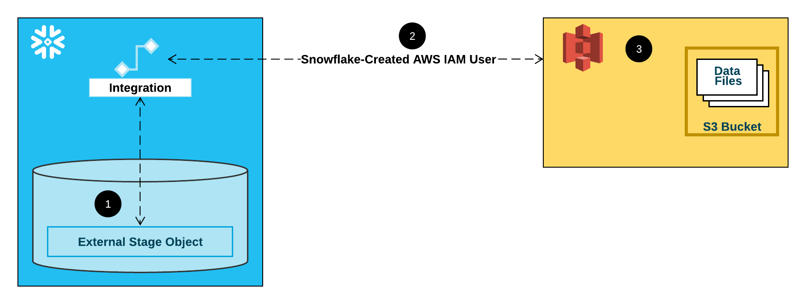
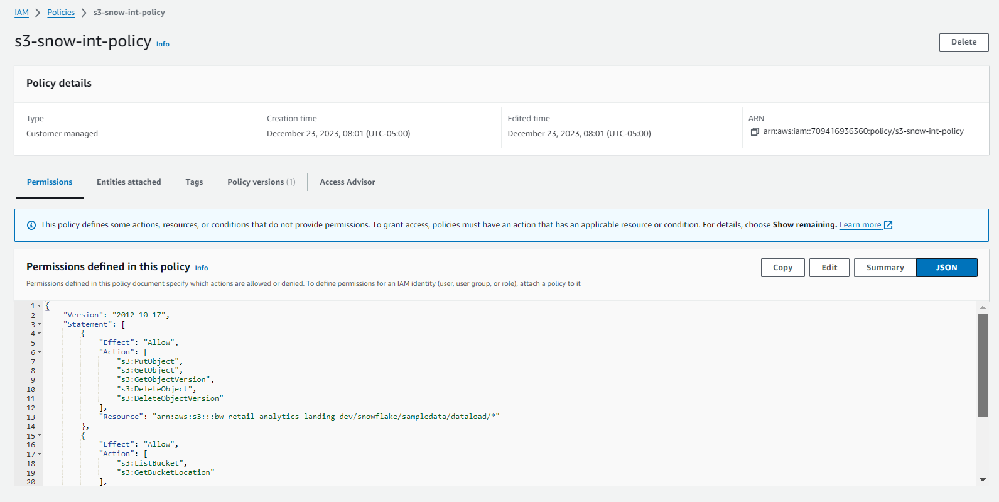
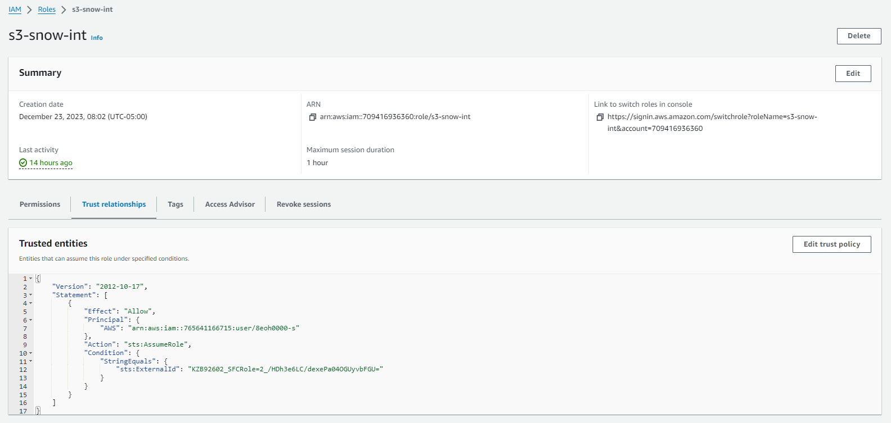

Data Loading in Snowflake

# Bulk Loading from Amazon S3 

## STEP-1 Create table 

> *CREATE OR REPLACE TEMPORARY TABLE contacts (*
>
> *id INTEGER,*
>
> *last_name STRING,*
>
> *first_name STRING,*
>
> *company STRING,*
>
> *email STRING,*
>
> *workphone STRING,*
>
> *cellphone STRING,*
>
> *streetaddress STRING,*
>
> *city STRING,*
>
> *postalcode STRING);*

## STEP -2 Create a file format object for CSV Data

> *CREATE OR REPLACE FILE FORMAT contactfileformat*
>
> *TYPE = 'CSV'*
>
> *FIELD_DELIMITER = '\|'*
>
> *SKIP_HEADER = 1;*

## STEP-3 Create Stage 

> Here you have 3 options
>
> 1\. Use data from public bucket where data is accessible to everyone
>
> 2\. Use AWS Access key and access secret key
>
> 3\. Use Storage Integration

### Use Public Bucket 

> Bucket has public access and everyone can access the data. You can
> create stage using below command
>
> *CREATE OR REPLACE STAGE contactstage*
>
> *FILE_FORMAT = contactfileformat*
>
> *URL = '*
> *s3://bw-retail-analytics-landing-dev/snowflake/sampledata/dataload/';*

### Use AWS Access key and access secret key

> *CREATE OR REPLACE STAGE contactstage FILE_FORMAT = contactfileformat*
>
> *URL =
> 's3://bw-retail-analytics-landing-dev/snowflake/sampledata/dataload/'*
>
> *CREDENTIALS = ( AWS_KEY_ID = 'XXXXXX' AWS_SECRET_KEY = 'XXXX' )*
>
> *DIRECTORY = ( ENABLE = true );*

### Use Storage Integration 

####  Configuring a Snowflake Storage Integration to Access Amazon S3

1.  *Create Policy*

> *Permissioned defined in this policy in JSON format is as blow*
>
> *{*
>
> *"Version": "2012-10-17",*
>
> *"Statement": \[*
>
> *{*
>
> *"Effect": "Allow",*
>
> *"Action": \[*
>
> *"s3:PutObject",*
>
> *"s3:GetObject",*
>
> *"s3:GetObjectVersion",*
>
> *"s3:DeleteObject",*
>
> *"s3:DeleteObjectVersion"*
>
> *\],*
>
> *"Resource":
> "arn:aws:s3:::bw-retail-analytics-landing-dev/snowflake/sampledata/dataload/\*"*
>
> *},*
>
> *{*
>
> *"Effect": "Allow",*
>
> *"Action": \[*
>
> *"s3:ListBucket",*
>
> *"s3:GetBucketLocation"*
>
> *\],*
>
> *"Resource": "arn:aws:s3:::bw-retail-analytics-landing-dev",*
>
> *"Condition": {*
>
> *"StringLike": {*
>
> *"s3:prefix": \[*
>
> *"snowflake/sampledata/dataload/\*"*
>
> *\]*
>
> *}*
>
> *}*
>
> *}*
>
> *\]*
>
> *}*

2.  *Create the IAM Role in AWS*

> *Assign policy created in above step and add trust relationship as
> shown below*

*Trusted entities are as below*

*{*

*"Version": "2012-10-17",*

*"Statement": \[*

*{*

*"Effect": "Allow",*

*"Principal": {*

*"AWS": "arn:aws:iam::765641166715:user/8eoh0000-s"*

*},*

*"Action": "sts:AssumeRole",*

*"Condition": {*

*"StringEquals": {*

*"sts:ExternalId": "KZB92602_SFCRole=2\_/HDh3e6LC/dexePa04OGUyvbFGU="*

*}*

*}*

*}*

*\]*

*}*

*Reference :
<https://docs.snowflake.com/en/user-guide/data-load-s3-config-storage-integration>*

#### Create storage integrator

> *CREATE OR REPLACE STORAGE INTEGRATION S3INT*
>
> *TYPE = EXTERNAL_STAGE*
>
> *STORAGE_PROVIDER = 'S3'*
>
> *STORAGE_AWS_ROLE_ARN = 'arn:aws:iam::709416936360:role/s3-snow-int'*
>
> *ENABLED = TRUE*
>
> *STORAGE_ALLOWED_LOCATIONS =
> ('s3://bw-retail-analytics-landing-dev/snowflake/sampledata/dataload/')*
>
> *DESC STORAGE INTEGRATION S3INT;*

#### Create Stage using storage integrator

> *CREATE OR REPLACE STAGE contactstage FILE_FORMAT = contactfileformat*
>
> *URL =
> 's3://bw-retail-analytics-landing-dev/snowflake/sampledata/dataload/'*
>
> *STORAGE_INTEGRATION = S3INT;*

## Finally copy data from stage to snowflake

> *COPY INTO CONTACTS*
>
> *FROM @contactstage/contacts1.csv;*
